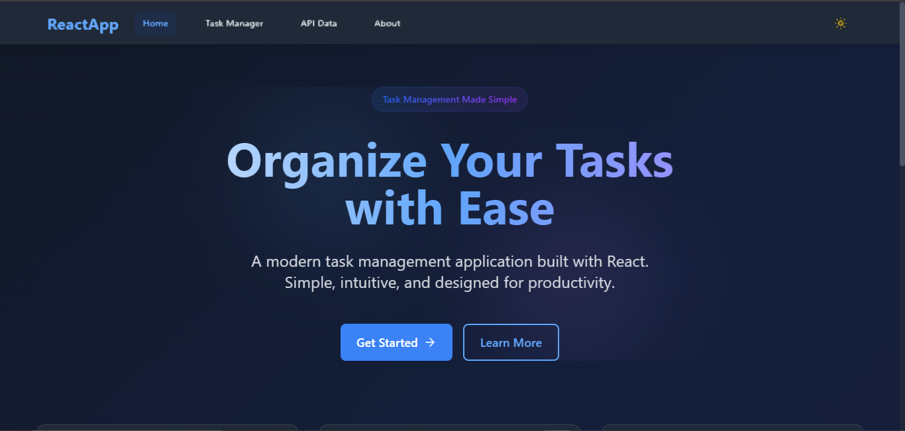

# React Task Management Application

A modern, feature-rich task management application built with React, showcasing best practices in component architecture, state management, and responsive design.

## 📸 Screenshot


## 🌐 Live Demo

[View Live Demo](https://your-deployment-url-here) <!-- Replace with your deployed application URL -->

## ✨ Features

- **📱 Responsive Design**: Flawless experience across all devices and screen sizes
- **🌙 Dark Mode**: Elegant theme switching with persistent preferences
- **🧩 Component Architecture**: Modular, reusable components following React best practices
- **⚡ Performance Optimized**: Lightning-fast loading with modern optimization techniques
- **🔗 API Integration**: Seamless data fetching with error handling and caching
- **💾 Local Storage**: Persistent data with intelligent state management

## 🛠️ Technologies Used

- **React 18+**: Latest React with Server Components, Suspense, and Concurrent Features
- **Tailwind CSS 3**: Modern utility-first CSS with JIT engine and custom animations
- **Vite 5.0**: Next-gen frontend tooling with HMR and optimized build performance
- **React Router 6**: Modern client-side routing with data loading
- **Lucide Icons**: Beautiful, consistent icons
- **Custom Hooks**: Advanced hooks patterns for state management

## 🚀 Getting Started

### Prerequisites

- Node.js (v14+ recommended)
- npm or yarn

### Installation

1. Clone the repository
```bash
git clone https://github.com/WayneChibeu/week-3-react-js-assignment-WayneChibeu-1.git
cd week-3-react-js-assignment-WayneChibeu-1
```

2. Install dependencies
```bash
npm install
```

3. Start the development server
```bash
npm run dev
```

4. Open [http://localhost:5173](http://localhost:5173) in your browser

## 📁 Project Structure

```
src/
├── components/        # Reusable UI components
├── pages/            # Page components
├── context/          # React Context providers
├── hooks/            # Custom React hooks
├── styles/           # Global styles and Tailwind config
└── api/             # API integration and configuration
```

## 🎯 Key Features Explained

### Task Management
- Create, edit, and delete tasks
- Organize tasks with categories and priorities
- Filter and search functionality
- Drag-and-drop task reordering

### Theme System
- Light and dark mode support
- Persistent theme preferences
- Smooth theme transitions
- Custom color schemes

### API Integration
- RESTful API consumption
- Error handling and loading states
- Data caching and optimization
- Real-time updates

### Performance Optimizations
- Code splitting and lazy loading
- Memoization of expensive computations
- Optimized re-renders
- Asset optimization

## 📱 Responsive Design

The application is fully responsive and optimized for:
- Desktop (1024px and above)
- Tablet (768px to 1023px)
- Mobile (below 768px)

## 🧪 Testing

Run the test suite:
```bash
npm test
```

## 🚀 Deployment

This project can be deployed to various platforms:

### Vercel
```bash
npm run build
vercel deploy
```

### Netlify
```bash
npm run build
netlify deploy
```

## 🤝 Contributing

1. Fork the repository
2. Create your feature branch (`git checkout -b feature/AmazingFeature`)
3. Commit your changes (`git commit -m 'Add some AmazingFeature'`)
4. Push to the branch (`git push origin feature/AmazingFeature`)
5. Open a Pull Request

## 📄 License

This project is licensed under the MIT License - see the [LICENSE](LICENSE) file for details.

## 👨‍💻 Author

**Wayne Chibeu**
- GitHub: [@WayneChibeu](https://github.com/WayneChibeu)
- LinkedIn: [Wayne Chibeu](https://www.linkedin.com/in/wayne-chibeu/)

## 🙏 Acknowledgments

- React Team for the amazing framework
- Tailwind CSS team for the utility-first CSS framework
- Vite team for the blazing fast build tool
- All contributors and supporters

---

Made with ❤️ by Wayne Chibeu
